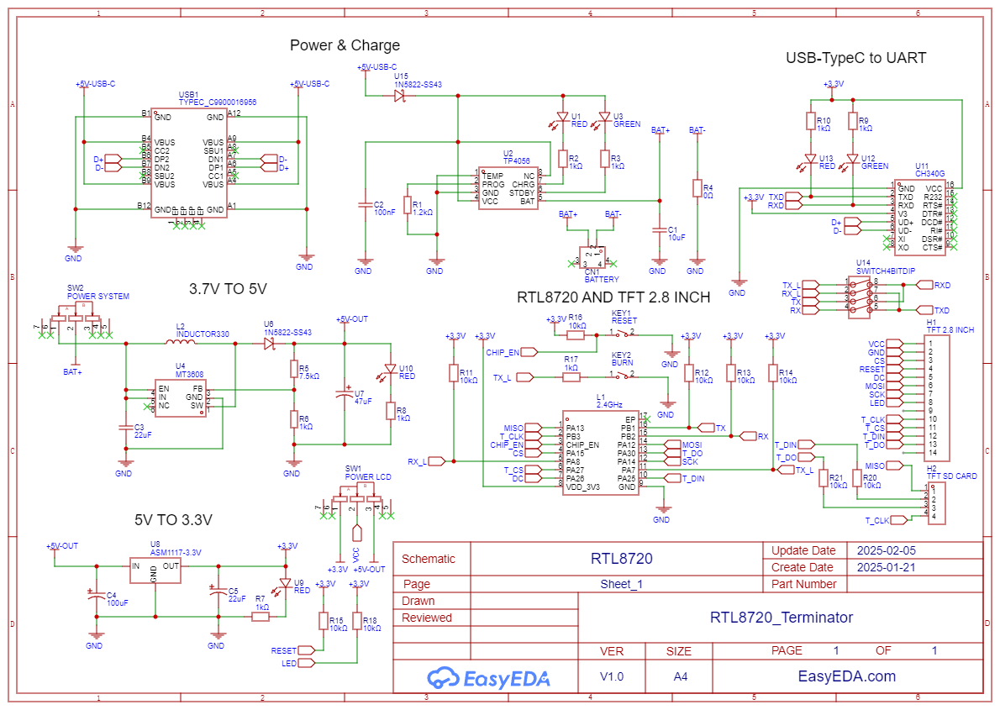
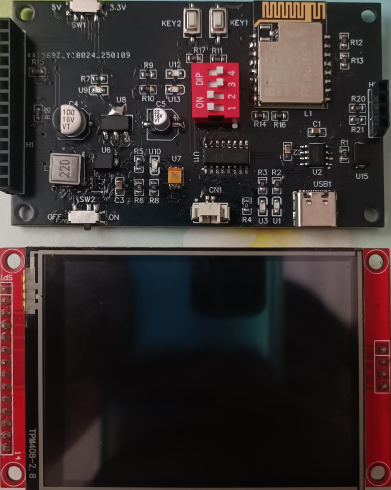
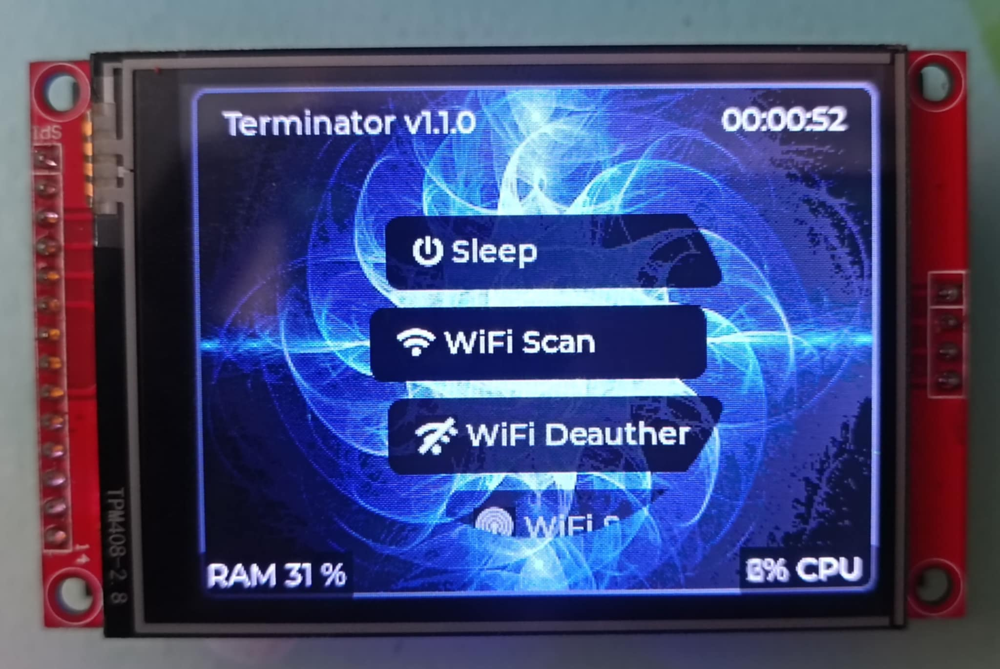

# RTL8720_TERMINATOR
Terminator is the firmware running on Chip Realtek RTL8720DN.
This firmware was designed for research purpose and wireless testing.

# Introduction

`Terminator` is a combination of the Arduino IDE along with the LVGL v8.3.0 library and several other libraries.

`List of Features`:

- Scan all Wi-Fi networks in the 2.4GHz and 5GHz bands.
- Can attack 2.4Ghz 5Ghz band wifi with wpa2 security except wpa3.
- Generate random spam wifi up to 100 wifi or user created.

  `Information device`:
  - BW16 RTL8720DN
  - TFT 2.8 INCH - ILI9341 - TOUCH
  - Password: 0000
    
# Schematic

# Product

# DOWNLOAD / UPLOADING

## Download firmware
Just clone this repository, this firmware is `km0_km4_image2_V1.1.1.bin`

## Upload firmware
1. Clone this repository to your Local Machine (PC or Laptop, Windows only)
2. Into folder `Image_Tool`.
3. Execute the `ImageTool.exe` by double click on the file.
4. `Chip Select` choose `AmebaD(8721D)`.
5. In the section `Flash Download`, check the box with the address `0x08006000` and then click `Browse` to select firmware `km0_km4_image2_V1.1.1.bin`.
6. In the section `Serial` select COM port RTL8720DN BW16 is connected.
7. Plug & press buttons on RTL8720DN BW16 to enter upload mode.
8. Press `Download` button to upload firmware.
9. Wait until the uploading completed
10. Press RST or disconnect the board from power then connect it back.

## Q&A

For any questions, go to my Tiktok account @quyle2304 for supporting.
